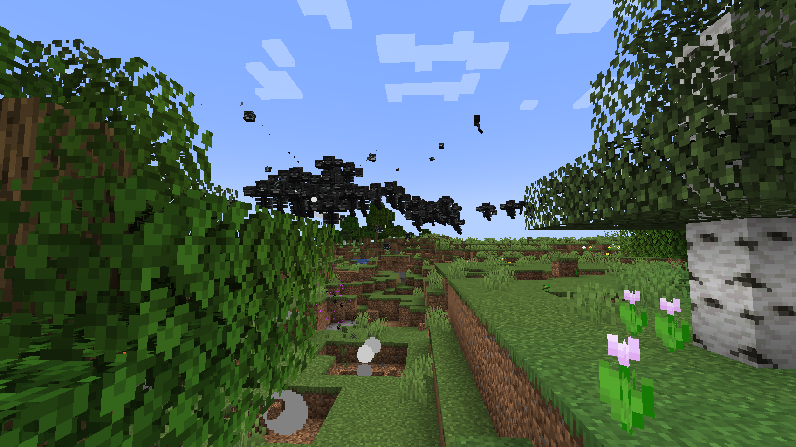

# Wither Survival

Every mob turns into Withers. Except for Endermen, Blazes, and the Dragon. The goal is to beat the game.

Inspired by [Azp3ct's video](https://www.youtube.com/watch?v=UVnBT9o40sQ), "Can You Beat Minecraft if Every Mob is the Wither?"

## Installation
1. Make a Bukkit, Spigot, or PaperMC minecraft server, following [this](https://www.youtube.com/watch?v=VQlUft3ITGE&t=283s) guide.
2. Download the latest release from the [releases](https://github.com/BjornTheProgrammer/Wither-Survival/releases) tab.
3. Unzip it if it is zipped, then drag and drop the jar into the `plugins` folder.
4. Start the server

## Warning

This plugin applies to all worlds, and will cause destruction to your worlds.

## Gameplay

The End has the Endermen replaced with Withers instead. Blazes and endermen still spawn naturally.

The time is always set to night, although it appears to look like day, add torches everywhere!

## Any other gameplay ideas?

I'd love to hear them, create an [issue](https://github.com/BjornTheProgrammer/Wither-Survival/issues), and let's see if it can be implemented.

## License

This plugin is licensed under MIT.
